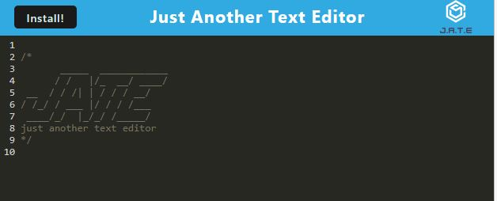

# "Just Another Text Editor" PWA Application

[live Site](https://pwa-text-editor-2.herokuapp.com/)

## Description
Given a pre-existing text editor app, the code in this application aims to make it into a PWA, allowing a user to download to their desktop and having a functional app when not connected to the internet. Suggested uses would be to store some helpful code snippets.

Benefits of making an app into a PWA (Progressive Web App):
1. Availability in the offline mode
2. Mobile-like behavior
3. Smooth installation directly on a users device
4. No app store submission
5. Use of hardware features

Learn more about PWA here:
- [link 1](https://mobitouch.net/blog/5-key-benefits-of-progressive-web-apps-pwa/)
- [link 2](https://learn.microsoft.com/en-us/microsoft-edge/progressive-web-apps-chromium/)

## Table of Contents

- [Preview](#preview)
- [Packages Used](#packages)
- [Installation](#installation)
- [License](#license)
- [Questions](#questions)

## Preview



## Packages

Project put together using the following libraries/packages:

- [Express.js](https://expressjs.com/)
- [concurrently](https://www.npmjs.com/package/concurrently)
- [idb](https://www.npmjs.com/package/idb)
- [code-mirror-theme](https://www.npmjs.com/package/code-mirror-themes)
- (all the differnet dev dependencies found within the package.jsons)

## Installation

1. After downloading a copy of the repo, open up your terminal and run the commands:

```
npm install
npm run start:dev
```

2. If the above is successful, then after downloading all the necessary packages, a dist folder will be generated and the server will open. Navigate to `localserver:3000`. 

## License

 [](https://opensource.org/licenses/MIT)

For more information about the licensing of this project, click the above image or follow this link https://choosealicense.com/licenses/mit/

## Questions

How to get into contact with me?

[My Github Profile](https://github.com/Jon-Ledo)

Email : jonledo.code@gmail.com
